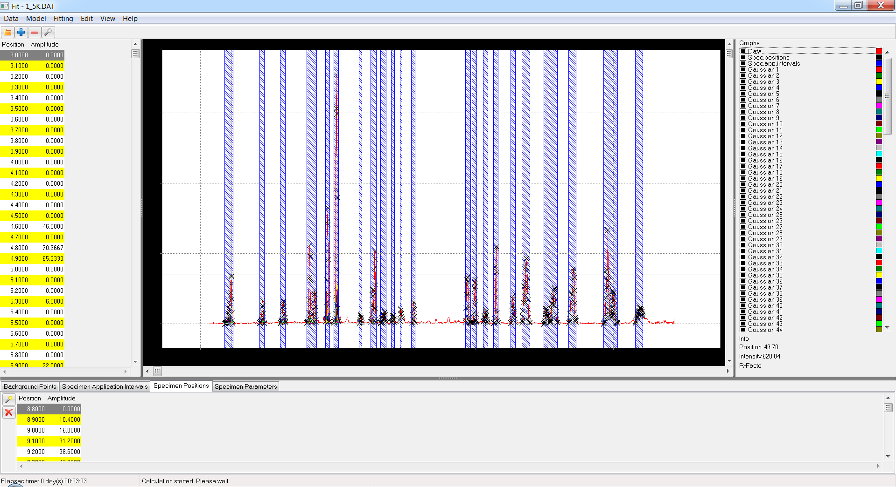

# fit

The curve fitting application. It allows to model data by set of curves of selected type.

Fully automatical mode is available.

The application is written in Free Pascal with Lazarus (Delphi is not supported) and is working under Windows and Linux (potentially could be compiled for Mac, but this was not done yet).

## Look how fully automated fitting works



## Plugin architecture

[How to add new data loader](how-to-extend-data-loaders)

[How to extend curve types](how-to-extend-curve-types)

To open and modify diagram files use my favourite [UMLet](https://www.umlet.com/).

## Desktop application



### Binaries

There is no installer. The main executable is Fit.exe.

#### Win64

[Fit](https://github.com/dvmorozov/fit/raw/master/Desktop/o/x86_64-win64/Fit-x86_64-win64.exe)
[MathExpr](https://github.com/dvmorozov/fit/raw/master/Desktop/o/x86_64-win64/MathExpr.dll)

MathExpr.dll should be put in the same directory as Fit.exe.

The project should be built with "Windows specific" option.

#### Linux-x86_64

[Fit](https://github.com/dvmorozov/fit/raw/master/Desktop/o/x86_64-linux/Fit-x86_64-linux)

The project should be built with "Portable" option.

### Command line parameters

__/INFILE=*file_name*__ - opens data file on application start up 

__/WRITE_PARAMS_LOG__ - turns on logging of variable parameters

On Windows log file is located in the folder
__C:\Users\user_name\AppData\Roaming\Fit-x86_64-win64__

### Test data set

[Zip](https://github.com/dvmorozov/fit/raw/master/Data/test_data.zip)

## More info

[Autogenerated documentation](doc/index.html)

[Autogenerated class diagram](doc/GVClasses.png)

[Autogenerated module diagram](doc/GVUses.png)

To generate documentation [PasDoc](https://rationalcity.wordpress.com/2018/08/11/how-to-create-documentation-for-pascal-project/) is used.

## Related projects

[fitminimizers](https://dvmorozov.github.io/fitminimizers/)

[fitgrids](https://dvmorozov.github.io/fitgrids/)




