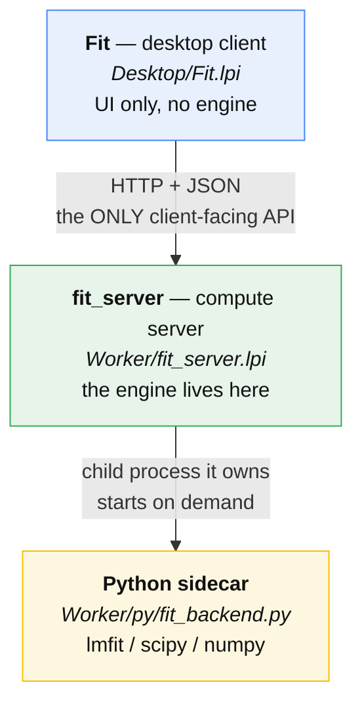
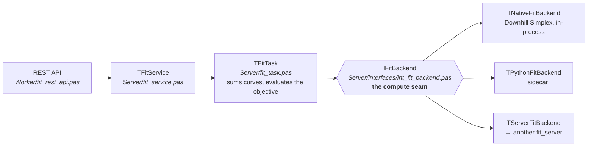
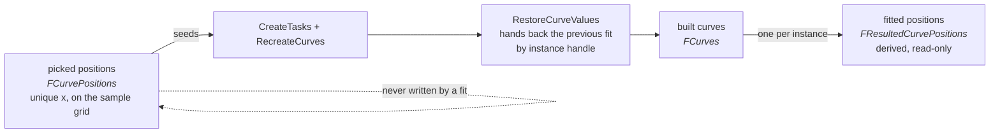
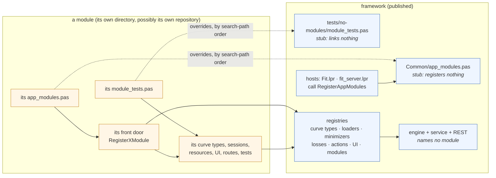
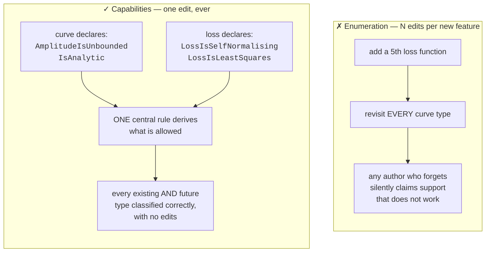
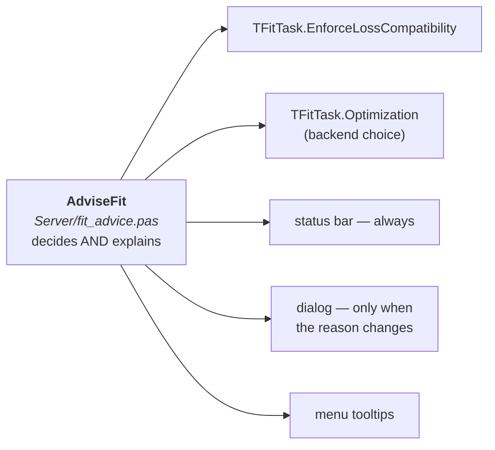

<!-- SPDX-License-Identifier: CC-BY-4.0 -->
# Architecture, and how to extend it

Fit began as a diffraction peak-fitting application. It is deliberately becoming
a **framework for experimentation across application domains** — the technical-analysis
pack is the second domain, and it was built almost entirely from parts that
already existed.

That is the measure this architecture is judged by. **The cost that matters is
not adding one more type today; it is what adding the *next* one costs someone
who was not part of the conversation that added the last one.** Everything below
exists to keep that cost low.

> Keeping this page current is part of the work, not a tidy-up afterwards. If
> you add or change an extension point, say so here in the same commit.

## Where the diagrams live

**The published diagrams are generated, and there is nothing to redraw.** Every
picture on <https://dvmorozov.github.io/fit/> is produced from this repository at
the moment the site is published, by the two generators below:

| Step | What it does |
|---|---|
| `scripts/dump-registries/` | An FPC console program. It links the registration front doors — `RegisterAppModules`, `RegisterAllCurveTypes`, `RegisterAllDataLoaders`, `RegisterAllMinimizers`, `RegisterBuiltInLosses`, `RegisterBuiltInActions` — and reads every registry back through the same public functions the application uses, printing the lot as JSON. |
| `scripts/gen-diagrams/` | Turns that JSON into Mermaid pages. Class hierarchies, which no registry can report, are parsed from the units. Standard-library Python only. |

`Invoke-Publish` runs both before the site snapshot and **fails the publish** if
either fails, so the diagrams can never be older than the code beside them.

**Why a program and not a script over the sources.** A registry is the only thing
that knows what is registered. Text matching gets it wrong in ways that matter:
the REST verbs go in through a local `Add` helper, so a naive pattern reports one
verb instead of fourteen; the registry tests register fakes, inflating every
count; and *which module directory was on the unit search path* — the entire
point of the module mechanism — leaves no trace a line match could find.

**Do not hand-edit a generated page** — the next publish overwrites it. To change
what a page says, change `scripts/gen-diagrams/`: the prose lives in
`content/*.html`, the look in `assets/style.css`, and the facts come from the
dump. A generated section is substituted into the prose at a `{{MARKER}}`
placeholder, and a missing placeholder is an error rather than a silently
dropped section.

**To look at the three sites before publishing them**, the maintainers' publish
tooling has a preview step. It regenerates, assembles each site the way a publish
would — the
`gh-pages` branch with the generated pages laid over it, so the screenshots and
the favicon are there too — serves the lot on localhost and opens all three.
Ctrl+C stops it.

It is served over HTTP rather than opened as `file://` on purpose: the pages
import Mermaid as an ES module, and a module import from `file://` is blocked as
cross-origin, so every diagram would silently be missing.

**The sites are plain HTML and there is no site generator.** They ran
`jekyll-theme-dinky` with a copied-and-edited layout on top; the theme is gone and
so is Jekyll. Each page is a complete document, and a `.nojekyll` file tells
GitHub Pages to serve the tree untouched. That is worth the loss of
README-as-a-page: what is opened in a browser locally is byte-for-byte what gets
served, so checking the site needs nothing installed.

The generated pages are committed to `gh-pages`, which looks redundant and is not.
`pages.yml` deploys that branch as committed, without running the generator, so
what is committed is what is served. It is reached by a stub workflow on the
`gh-pages` branch, because a push runs the workflows of the branch pushed and
the real one lives on `main`.

Nothing on the page is rewritten at deploy time. The download links go through
GitHub's `/releases/latest/download/` redirect, so the site can be published
before, during or after a release and is never left pointing at a version that
does not exist. What that costs is a name the release must keep, and a release
that is complete before it is a release: `public-release.yml` uploads into a
DRAFT, and `verify-assets` publishes it only once every archive the download
table links is attached. `/releases/latest/` ignores drafts, so a release with a
failed platform stays invisible and the site goes on serving the last complete
one — rather than becoming "latest" with three dead links, which is what a
release published asset-by-asset does the moment its first job finishes.

The dumper asserts the seam count, the sibling generator asserts that every
component it documents still exists, and the fit generator asserts two more
things: that every class or interface named in a hand-composed figure is still
declared in the sources, and that each parsed hierarchy still contains its
anchors. Add or remove a seam, or rename a class out from under a picture, and
generation stops with a message naming it — rather than quietly publishing a
picture with one fewer box.

**The hand-drawn UMLet diagrams are gone.** `Design/*.uxf` and the exported PNGs
beside them were deleted once the generator covered what they said; git history
keeps them. Each topic has a generated equivalent, and none of them is a copy:

| What the UMLet diagrams showed | Where it is now |
|---|---|
| communication classes, call chain, server classes | the client-to-server call chain on `architecture.html` — the live REST path only, since the wst/SOAP proxies and the CGI client they drew are in no project file any more |
| the threaded-subclass notification sequences | *Watching a fit run* on `architecture.html` — the inline path only: `TFitServiceWithThread`, `TFitTaskWithThread`, `TFitServiceMultithreaded` and `TFitServerApp` are deleted, having had no caller since the engine moved behind REST |
| `FitViewer` and its extension | *The view seam* on `architecture.html` |
| the `TPointsSet` hierarchy and the curve-type registry | *The curve classes* on `how-to-extend-curve-types.html`, parsed from the units |
| configurable and user-defined curve types | *Curve types the user defines* on the same page, plus the two-dialog sequence |
| the data loaders | `how-to-extend-data-loaders.html` |

The PasDoc API reference that used to sit in `gh-pages:doc/` is gone too — 217
files, last regenerated in 2020, that nothing ever linked to.

Mermaid blocks in this file and the other `docs/` pages stay hand-written and are
rendered by GitHub. They describe decision structure and process flow, which is
reasoning rather than something a registry can report.

## The shape of the system

Three processes. The client holds **no fitting engine at all**.

Two rules that are easy to break and expensive to unbreak:

- **`fit_server` is the only client-facing endpoint.** Every backend lives behind
  it. The desktop never talks to the sidecar.
- **The sidecar is owned by `fit_server`**, started as a child process when
  needed — not a service the client discovers.

## Inside the server: the fit path

**One task is one fit interval.** `TFitService.CreateTasks` builds a sub-task per
selected interval and hands it only that stretch of the profile, so the intervals
need no further machinery downstream: everything a task measures is, by
construction, measured over its interval. The service then pools the parts into
one figure. See [`loss-functions.md`](loss-functions.md) § Which points a figure
covers.

**Input and result are separate sets, and that is load-bearing.** The picked
curve positions are model input: unique x values that name real samples, each one
the seed its curve is rebuilt from, and each one carrying the **handle** that
says which instance it stands for - so that curve's fitted parameters can be
handed back to it after a model edit rebuilds everything. Where the curves
*ended up* is a different statement, so it is a different set -
`CreateResultedCurvePositions` derives it from the collected curves and nothing
reads it back.

This is what makes fit → edit → fit work: the pick carries a handle issued once
and kept, so the previous round's values are found again whatever else changed.

The handle is ISSUED, not derived, and that is the whole point. It used to be a
hash of the instance's initial parameter values, which meant moving a pick
changed the key and orphaned everything stored under it - so the move was
refused. A move now rekeys instead: the curve keeps the shape the optimiser
found and is re-seeded where the user put it. See
[`curve_identity_registry.pas`](../../Server/curve_identity_registry.pas), and
`Server/fit_advice.pas` for the one move still refused - a module's markup
places every instance at once, so there is no correspondence to carry.

`IFitBackend` is coarse on purpose: **one call performs one whole fit**. That is
what lets a backend be in-process, a subprocess, or a machine across the network
without the fit path knowing which.

The wire contract (`Worker/fit_problem_json.pas`) is deliberately **engine-free
plain records**, so it can be tested in isolation and marshalled across a process
boundary. `Server/fit_task_marshalling.pas` maps both ways.

### The module boundary

Every arrow crosses from the module to the framework. There is none the other way,
and that is the whole design: the framework can be built, tested and published
without any module existing.

A build with no module links the two stubs, registers nothing extra, and every
module path becomes a no-op. Removing a module's directory from the search path
removes the module from that binary, and removes it completely.

## The extension points

| Extension point | Add one by | Guide |
|---|---|---|
| **Module** (a whole vertical) | A directory + one registration unit + one search-path entry | [writing a module](writing-a-module.md), [`Modules/example-linear/`](../../Modules/example-linear/README.md) |
| **Curve / lineshape model** | Subclassing `TNamedPointsSet`, self-registering in `initialization` | [adding a curve model](adding-a-curve-model.md) |
| **Argument axis** | Implementing the axis contract; presentational only | [adding an argument axis](adding-an-argument-axis.md) |
| **Data loader** | Implementing `int_data_loader` and registering it in the loader registry | `Desktop/DataLoaders/ohlc_csv_loader.pas` is the worked example |
| **Compute backend / transport** | Implementing `IFitBackend` and registering it | [client/server](client-server.md) |
| **Minimizer** | Registering a `TMinimizerInfo` that declares what it needs | `Server/minimizer_registration.pas` |
| **Loss function** | Registering a loss that declares its own compatibility facts | [loss functions](loss-functions.md) |
| **REST action** | Registering a `TActionInfo` — also the scripting surface | `Worker/action_registry.pas` |
| **UI menu, Tools-pane buttons, panel, pick mode** | Implementing `IUiModule`, declaring the menu as data | [writing a module](writing-a-module.md) |
| **Sidecar route** | `@routes.get` / `@routes.post` in `<name>_routes.py`, in the module's own `Worker/py` | `Worker/py/routes.py`, `fit_backend.load_module_routes` |

Every one of these is a registration call. **Adding any of them requires no edit
to an existing file** — which is the property the whole arrangement exists to
have, and the one a reviewer should check first.

### The one idea that makes this cheap: capabilities, not enumeration

An extension states **facts about itself**; a single central rule derives what
those facts imply. It never enumerates its compatibility with every other
feature.

Worked examples in the codebase:

- `TNamedPointsSet.IsAnalytic` — "do I have a closed form?" → drives whether the
  formula-based backends can be used at all.
- `TNamedPointsSet.AmplitudeIsUnbounded` — "can my amplitude grow freely?" →
  drives which objectives are legitimate (`Server/loss_compatibility.pas`).
- `LossIsLeastSquares` — "am I a sum of squares?" → drives which engines can
  minimise me.

**The discipline that keeps it from bloating:** a capability describes a
*property of the model*, never a preference or a named special case; and a new
capability is introduced when a **second** real case needs it, not in
anticipation. Speculative vocabularies are how capability models turn into worse
enumerations.

### The corollary: a refusal must explain itself

Deriving compatibility means the app will sometimes override what the user chose.
Every such correction is sound — and invisible, which makes it
indistinguishable from a bug the moment someone notices the result does not match
their selection.

So **the decision and its explanation are the same code**:
`Server/fit_advice.pas` is called by the engine *and* by the UI. A separate UI
copy would drift, and a UI that confidently explains something the engine no
longer does is worse than silence, because it would be believed.

If you add a capability-derived refusal, route its user-facing explanation
through this unit rather than inventing your own.

## Extend, do not bypass

The architecture is only cheap to extend if extensions go *through* it. A parallel
channel is worse than a missing feature: it duplicates the truth, drifts from it,
and hides the real defect behind something that looks like progress.

**Before adding any unit, verb, wire contract or record, find how the app already
does the analogous thing.** For anything crossing the client/server boundary, read
`Desktop/http_fit_service.pas`'s implementation of the nearest existing verb — that
is where the truth about what actually reaches the client lives, and it is not
always what the server appears to send.

Two tells that you are building a bypass:

- **it needs a join key** back to an existing contract — then it is probably a
  bypass *of* that contract, and the original should be extended instead;
- **it works in tests but not in the app** — usually because the tests exercise
  in-process objects while the real path goes over HTTP and carries less.

Real example, kept because it cost the most: a module's per-curve metadata was thought to need
a new wire contract. `GET /curves` had always carried every curve's parameters,
and the client had always rebuilt them. The whole gap was that `value` is a JSON
number, so a GUID-valued parameter arrived as `0`. One field — `kind`, saying
what `value` holds, mirroring the `error` field beside it.

The same lesson decided where a curve's own handle went when instance identity
was reworked: **not** into a parameter. A parameter is a quantity of the model,
and `value` is a number; the handle is a handle to the object, so it is its own
field beside `params`.

## Invariants worth knowing before you change anything

These are the ones that are expensive to rediscover. Each is pinned by a test
named after it.

| Invariant | Where | Why it matters |
|---|---|---|
| The client contains no engine | `Desktop/` | `strings Fit \| grep -x TFitTask` must find nothing |
| `fit_server` is the only client-facing endpoint | `Worker/` | Backends stay swappable |
| R-factor bounds define **independent** sub-problems | `Server/fit_task.pas` | Intervals may not overlap — this is what will allow parallel fitting |
| A curve position's `y` seeds the amplitude | `RecreateCurves` | Dropping it starts a fit from zero amplitude that never converges |
| Statistics use a fixed residual, whatever was minimised | `fit_statistics` | Otherwise χ² and AIC/BIC stop being comparable |
| A component of an additive model is exactly zero outside its support | `Modules/example-linear/linear_points_set.pas` | The additive sum is meaningless otherwise |
| Nothing reads pixels back off a canvas | `Packages/TAGraph` | One blocking X round trip per pixel; see below |
| A menu item is never freed by its own `OnClick` | `Desktop/Forms/form_main.pas` | The widgetset is still holding it — see below |
| Every process logs by default, with no switch | `Common/log.pas` | A fault has to be readable from the log the run already wrote |

### Drawing: no read-back, and bands go first

The chart draws each series onto an off-screen bitmap and blits it once. Series
that paint an *area behind* the data — the fit-interval band and the
selected-points band — say so through `TTASerie.IsBackgroundBand`, and
`TTAChart.DisplaySeries` makes two passes: bands first, data on top. Nothing
enumerates which series precedes which; each is asked.

That ordering exists to replace something worse. Both bands used to be painted a
pixel at a time, reading each pixel back (`Canvas.Pixels[x,y] = GraphBrush.Color`)
so the hatch would skip pixels a curve already occupied. On Windows a pixel read
is a local GDI call. On X11 it is `gdk_drawable_get_image(d, x, y, 1, 1)` — a
synchronous round trip to the X server, with the process blocked on the reply.
Over a band spanning the plot that is hundreds of thousands of round trips per
repaint, and since a fit interval defaults to the whole profile, it was every
repaint. It is why every operation in the application lagged for seconds, while
the server log showed nothing above 1 ms.

The hatch is now drawn as what it always was — the pixels where `(x±y) mod 5 = 0`
are a family of parallel diagonals five pixels apart — using `MoveTo`/`LineTo`
with the segments clipped arithmetically, so the result is identical on every
widgetset. **Do not reintroduce a canvas read-back**, and be wary of any drawing
whose cost scales with the pixel count rather than the data.

### Menus: rebuild from the main loop, never from a click

`CreateCurveTypeMenus` starts by clearing the menu, which destroys its items —
and those items' `OnClick` handlers are what ask for the rebuild. Calling it
directly from such a handler frees `Sender` while the widgetset is still
dispatching the click, and the fault lands inside the widgetset with no frame of
ours on the stack. Handlers therefore call `QueueCurveTypeMenuRebuild`, which
defers the work to the main loop via `Application.QueueAsyncCall` — the same
treatment, for the same reason, that `QueueError` gives a dialog raised from a
timer or a menu.

### Log tiers: the line between value and volume

Both processes start at `Debug` and need no switch to be useful; `FIT_QUIET_LOG`
builds a quiet binary. One tier sits *below* the default — `Trace` — and it is
not a dumping ground for things thought unimportant. It is for **inner loops**:
output whose volume is set by an iteration count rather than by anything the
user did. Today that is the routes the client polls twice a second
(`Common/rest_polling.pas`, single-sourced so client and server cannot disagree)
and the minimizer's per-iteration progress.

The distinction is volume, not value. A three-second fit raises the minimizer's
progress over three hundred times; left at `Debug` it is 86 % of the file, and
because the log rotates it does not merely add noise — it evicts the events that
say what the user did. Those lines are still diagnostics and are still kept, one
switch away (`--log-level trace`, `/LOG_LEVEL=trace`). Anything bounded by user
actions belongs at `Debug`, where it is on by default.

### Seeing a slow repaint

`TTAChart.OnPaintTiming` reports the duration of every repaint, broken down both
by **phase** (`clean`, `title`, `axis`, `series`, `legend`, `reticule`, `blit`)
and by **series**; `TFormMain` routes it to `client_log.LogClientTrace`. Only
parts that took measurable time are named, so an ordinary repaint reports a bare
duration and a slow one names what was slow. This costs nothing to leave on and
is the only vantage point from which a slow chart is visible at all — a repaint
makes no server call and falls between two user actions, so neither the server
log nor the UI-action tier can see it.

It has already earned itself twice. The band's per-pixel read-back showed up as a
series costing seconds; and once that was gone the breakdown pointed at `axis`,
which turned out to be a `Sleep(1)` left in `CalculateBounds` behind an
`if Maxi>59`. `DrawAxis` calls that routine three times a repaint — once on Y to
size the left margin, then once each for the X and Y mark loops — and every axis
in this application runs past 59, so every repaint slept three times doing
nothing. Removing it took the repaint median from 14 ms to 2 ms and the worst
case from 182 ms to 13 ms, measured over real sessions on the same machine.

Two lessons worth keeping: **`Sleep` in a paint path is not a small bug**, and a
cost that is invisible to every log tier will stay unattributed for as long as
something bigger is masking it. Note also that `Paint`'s and `Refresh`'s
preambles run before the phase clock starts, so a repaint whose phases do not sum
to its total is spending the difference there.

## Testing, and why the suite is split in two

Every Pascal test class registers itself into one of two suites, and which one is
not a judgement about speed:

| Suite | Command | A test belongs here when |
|---|---|---|
| `unit` | `./scripts/build-app.ps1 -Task test -Suite unit` | it needs nothing outside its own process |
| `integration` | `./scripts/build-app.ps1 -Task test -Suite integration` | it starts a compute server, speaks HTTP, needs the Python sidecar, reads or writes a file, or runs the optimiser to convergence |

259 unit tests run in well under a second; all 385 take about two minutes. That
ratio is what makes the split worth having: the unit half is cheap enough to run
on every edit, and it is the half **line coverage is measured over** — an
integration test drives the same lines repeatedly to check behaviour, so it
inflates the number without reaching anything new. A unit run also builds no
compute server, because a unit test has nothing to ask one.
`tests/testcase_suite_split.pas` fails the suite when a class registers into
neither half, since an unclassified test drops out of `--suite=unit` without
failing anything.

How the suite is *built* is a separate axis from which half runs.
`-Task test` builds it with `lazbuild --widgetset=nogui`, linking the LCL
headlessly, and that binary carries everything. `tests/build.sh` builds a smaller
one with plain FPC and no LCL, for a machine without Lazarus; it is **not** the
unit suite — seven unit classes are missing from it and four integration classes
are in it. The Python sidecar has its own suite
(`Worker/py/.venv/bin/python -m pytest Worker/py`) at an enforced **100 %**
coverage gate.

Prefer a unit test. A decision table expressed over plain values can be tested
exhaustively in milliseconds; the same logic reached only through a live
`TFitTask` usually cannot be tested at all — and only the unit half is measured.

**Logic does not live in UI classes.** An LCL descendant cannot be instantiated
headlessly, so anything decided inside one is unreachable by any test: the
decision belongs in a counted module that a unit test can drive, leaving the UI
class to read controls and forward. `Desktop/int_ui_host.pas` and
`Desktop/int_fit_viewer.pas` exist as that seam, and `Desktop/pick_target.pas` is
the pattern already applied. [testing](testing.md) gives the rule and what
coverage counts.

The modules already lifted out of the window and the chart, each of which a unit
test drives directly:

| Module | What it decides | Lifted out of |
|---|---|---|
| `Desktop/action_state.pas` | which commands the window offers and which are ticked | `form_main` — four methods packing bit flags into widget `Tag`s |
| `Desktop/pick_guidance.pas` | what the user is told next while picking, and when a gesture ends | `form_main` — nested `case`s in a chart click handler |
| `Desktop/outline_layout.pas` | the tree a module's flattened outline describes | `form_main` — inside the method that fills a `TTreeView` |
| `Desktop/parameter_kinds.pas` | how a parameter is treated, in the terms the table shows | `form_main` — beside the colours that paint it |
| `Desktop/curve_type_menu.pas` | which group each curve type goes in, and the order the groups appear | `form_main` — a method creating `TMenuItem`s |
| `Desktop/module_menu.pas` | the menu a module's declarations describe | `form_main` — the same, for a module |
| `Desktop/grid_edit.pas` | what editing a cell of the profile table means | `form_main` — an editing-done handler |
| `Desktop/table_export.pas` | how a table leaves this program as text | `form_main` — a method that opens a save dialog |
| `Desktop/custom_axis.pas` | what a user-defined axis starts as, and when it is usable | `form_main` — between a dialog and a message box |
| `Desktop/typed_number.pas` | a number as a user typed it | `form_main` — a `StrToFloat` behind a swapped global separator |
| `Desktop/status_readout.pas` | the numbers along the bottom of the window | `form_main` — three handlers and a resize |
| `Desktop/legend_layout.pas` | where the pieces of a legend row sit | `form_main` — an owner-draw handler |
| `Desktop/points_tables.pas` | how many rows the small grids need, and what is in them | `fit_viewer` — expressions assigned to `RowCount` |
| `Desktop/summary_table.pas` | what the datasheet says about a fit | `fit_viewer` — written a grid cell at a time |
| `Desktop/series_palette.pas` | which colour a curve is drawn in | `fit_viewer` — a conditional inside a nested procedure |
| `Desktop/parameter_roles.pas` | which parameter of a user curve is the abscissa, position, amplitude, width | the properties dialog — the same rule in four handlers |
| `Desktop/formula_editing.pas` | what a formula keypad does to the text and the caret | the formula dialog — inside a `with EditExpression do` |
| `Desktop/ui_scaling.pas` | what pixel density the interface is laid out for | `ui_dpi` — behind `Forms` and gdk |
| `Server/curve_list.pas` | what the parameter table shows and accepts | an LCL grid presenter |
| `Desktop/pick_target.pas` | which sample a click means | a chart click handler |

Each landed with its tests in the same change, and each left its UI class
smaller. The rule that keeps it honest is in [testing](testing.md): the excluded
wrapper group's line count may only shrink.

**Self-enforcing tests** are the house speciality and the reason this scales: a
test that walks the registry and asserts every registered thing has fixtures will
fail when someone adds the next one without them. Line coverage is measured here,
but these do the job it cannot — they check the cases that matter rather than the
lines that ran, and this project's recurring failure is a green suite over a path
the user never takes.
