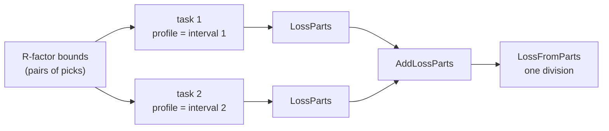

# Loss functions — choosing what a fit minimises

For most of this app's life there was one objective, hard-wired. That is fine for
one domain and wrong for a framework meant to carry several, so the objective is
now a choice. This page is the *why*; the code is
[`Server/fit_loss.pas`](../../Server/fit_loss.pas) and
[`Server/loss_compatibility.pas`](../../Server/loss_compatibility.pas).

## What the original form got right, and where it breaks

The original objective is

```
sum over compared points of (calc * s - obs)^2
------------------------------------------------
        (sum of calc over the profile)^2
```

where `s` is the curve-scaling factor the native engine fits analytically,
`s = (sum obs) / (sum calc)`.

**Dividing by an integral is right.** It is what makes an R-factor a
dimensionless *relative* measure, so the same sample measured with ten times the
counting time scores the same. That intent is sound and is kept.

**Dividing by the *model's* integral is where it breaks — but only in company.**
For a good fit `sum(calc) ≈ sum(obs)`, so the choice of denominator looks
immaterial, which is why it stood for 25 years. It stops being immaterial once
**curve scaling** is on. The engine then sets `s = (sum obs)/(sum calc)`, which
makes `calc * s` — and hence the entire numerator — invariant under a change of
model amplitude, while the denominator `(sum calc)^2` still grows with it.
Minimising therefore rewards **inflating the model**, along a direction that
changes nothing about the agreement with the data.

The defect is the **interaction of the two**, not the normalisation on its own.
Dividing by `sum(obs)` — as the standard `Rp`/`Rwp` do — serves the identical
intent with a denominator that is *constant during the fit* and therefore cannot
be gamed.

**Why diffraction never hit it.** A peak's amplitude is seeded from the data it
sits on and stays near it, so the degenerate direction is never explored. The
The first model with a genuinely free amplitude found
the defect immediately: fitting made the independent residual worse
(3723 → 9948) while the reported figure improved.

Two further notes for anyone re-deriving this:

- The scaling *is* a real internal normalisation and it *does* remove amplitude
  from the numerator. It does not remove the degenerate direction — it relocates
  it into the denominator.
- The original also summed its normalising integral over the *whole* profile
  while comparing only the selected fitting intervals, so the figure depended on
  how much unfitted profile happened to sit either side of them. Every objective
  now normalises over exactly the points it compares.

## The forms available

| Kind | Value | Formula | Use it when |
|---|---|---|---|
| `LOSS_KIND_RFACTOR` | **0** | `Σ(calc·s − obs)² / (Σobs)²` | **The default.** Normalised by the data: no degenerate direction, and values are comparable *across datasets*. |
| `LOSS_KIND_RFACTOR_LEGACY` | 1 | `Σ(calc·s − obs)² / (Σcalc)²` | Comparing against the original behaviour. |
| `LOSS_KIND_SUMSQ` | 2 | `Σ(calc·s − obs)²` | Interpretability. Minimised by the *same* parameters as the corrected R-factor — they differ only by the constant `Σobs²`. |
| `LOSS_KIND_RELATIVE` | 3 | `Σ\|calc·s − obs\| / Σ\|obs\|` | The `Rp` form. Less sensitive to a few large misfits; reads directly as "off by this fraction". |

**The corrected form is `0` deliberately.** A `TFitTask` can be built through the
inherited `TComponent` constructor, which leaves the field zero-initialised — so
whatever `0` means is what unconfigured code silently gets, and that must be the
objective we would have chosen rather than merely the oldest one. A test asserts
it.

The **reported** R-factor (`GetSqrRFactor` / `GetAbsRFactor`, what the UI shows
and what `MaxAcceptableRFactor` is compared against) is normalised by the
observed integral too. A displayed figure that can be improved by inflating the
model is misleading whatever is being minimised, and a reported number that
disagrees with the objective is worse still.

### Measured on real diffraction data

`Data/2.dat`, eight overlapping 2-branch Pseudo-Voigt peaks, 48 parameters
(`testcase_loss_real_data.pas`). Each objective is scored twice — by squared
residual, and by the absolute measure `sum|d| / sum|obs|` that the relative form
actually minimises. Scoring only in L2 judges three of the four by someone else's
yardstick.

| Objective | Residual (L2) | Abs. deviation (L1) |
|---|---|---|
| **R-factor (corrected, default)** | **660 287** | **0.0487** |
| R-factor (legacy) | 666 751 | 0.0487 |
| Sum of squares | 660 287 | 0.0487 |
| Relative deviation | 1 201 860 | 0.0636 |

Diffraction fitting is not merely preserved — the corrected form is identical to
plain least squares, as the algebra predicts.

**Relative deviation is an open defect, not a yardstick artefact.** It reaches
0.0636 on its own measure where the squared form reaches 0.0487; a loss should be
the best there is at its own objective. Ruled out: curve scaling (turning it off
makes the figure worse still, 0.0837). What fits the evidence is that `sum|d|` is
piecewise linear, with a kink wherever a residual crosses zero, and a downhill
simplex stalls on the flat facets of such a surface — no reflection improves, so
every convergence test agrees it has arrived. If so the answer is a solver suited
to a non-smooth objective, not another tolerance. **Unverified.**

## Which points a figure covers

One rule, and it is the reason fit intervals are selectable at all:

> a figure is measured over the **selected fit intervals**, and over nothing else.

A bar outside every interval is not modelled by anything, so including it measures
the data's distance from zero rather than the model's distance from the data.

| Question | Answer | Where |
|---|---|---|
| Which points? | every point of the task | `TFitTask.CollectFittedPoints` |
| Why is that the interval? | a task **is** one interval | `TFitService.CreateTasks` slices `BegIndex..EndIndex` |
| No interval selected? | the whole profile is materialised as one | `CreateTasks`, and it is an ordinary interval thereafter |
| Several intervals? | parts pooled, divided once | `TLossParts`, `AddLossParts`, `LossFromParts` |
| Objective and reported figures? | same points, same formulas | all three go through `CollectFittedPoints` + `EvaluateLoss` |



**Pooling, never summing.** A ratio is not additive: adding two intervals that
each read 0.01 gave 0.02, so marking a second, equally well fitted interval made
the model read as twice as bad. Two intervals of identical quality must read the
same as one.

**Not by curve range.** An earlier attempt had each curve publish the stretch it
answered for, with the figure taken over the union. That overrides the interval
the user chose and makes the number depend on where the model happens to sit.
Rejected; the intervals are the authority.

### What a constant term does to convergence

Worth keeping, because the symptom looks like a minimiser fault and is not. Write
the objective as `f = (S + C) / K`, for the modelled residual `S`, the unmodelled
constant `C` and the normalising `K`. The simplex's stopping test is a *relative*
spread, `2|f_hi - f_lo| / (|f_hi| + |f_lo|)`:

| Term | Cancels? | Consequence |
|---|---|---|
| `K` (normalising) | yes | a constant multiplier never mattered |
| `C` (unmodelled bars) | **no** — survives in the denominator | the test reads smaller than the real disagreement |

Measured on a 240-bar series with one pattern over bars 76..239: `C/S ~ 328`, so
the test read ~330× low and its 0.001 threshold was met while the simplex
vertices still differed by a third. The fit stopped after two cycles. Excluding
the unmodelled bars removes `C`.

## Compatibility is derived, not enumerated

One rule, in one place:

> a **self-normalising** loss may not be used with a model whose **amplitude is
> unbounded**.

Both halves are capabilities the participants declare about themselves —
`fit_loss.LossIsSelfNormalising` and `TNamedPointsSet.AmplitudeIsUnbounded` — so
a seventh curve type, or a fifth loss function, becomes compatible or
incompatible **automatically**. Nothing enumerates type names, because the
enumerated version rots the moment someone adds a type and does not find the
file listing them.

Enforced in two places, because they fail differently: the UI disables what
cannot be chosen, and the engine refuses what it is asked to do anyway — a client
is not to be trusted, and tests and the demo runner reach the engine directly.
The engine **substitutes** the corrected R-factor and logs why, rather than
failing: a usable fit beats an error, as long as the substitution is said aloud.

## Curve scaling is part of the same story

`TFitTask.GetScalingFactor` fits one global multiplier from the ratio of
integrals. For a peak, whose amplitude is seeded from the data, that genuinely
helps — it absorbs a systematic offset the optimiser would otherwise spend
iterations on.

For a model that sets its **own** amplitude it is a duplicate degree of freedom,
and a harmful one. The objective goes flat along the whole family with `A·s`
constant, so nothing pins the model's size; and because `s` comes from an
*integral*, any shape with the right integral satisfies it. Fitting real FX data
collapsed such a model to a flat line with `s = −1.449` — the scaling
factor reproducing the data's mean, the pattern contributing nothing — behind a
plausible-looking 4 % residual.

So curve scaling is switched off exactly when the model scales itself, derived
from the same capability.

**This exposed a real gap in that model**, which scaling had been masking:
unit pivots always start at `y = 0`, so an absolute (root) component started at
zero and could not represent a currency pair trading near 1.1. Multiplying by `s`
looked like it worked and is not the same operation — it cannot move a curve from
0 to 1.1 without stretching everything above it. Hence the `y0` level parameter,
which applies in **absolute form only**: adding it in deviation form would lift a
nested component off zero at its endpoints and break the continuity the additive
model rests on.

## Both engines must minimise the same thing

Selecting an engine should change the speed and the uncertainties, never the
question being asked. The Python sidecar drives scipy's `least_squares`, which is
handed a residual **vector** and minimises the sum of its squares — so it can
only honour objectives that *are* a sum of squares, up to a positive constant:

| Objective | Sidecar | Why |
|---|---|---|
| R-factor | ✅ | `Σresid² / Σobs²` — a constant multiple of the sum of squares, so the **same minimiser**. |
| Sum of squares | ✅ | The solver's native form. |
| R-factor (legacy) | ❌ | Denominator moves with the parameters: a ratio, not a sum of squares — the very property that makes it gameable. |
| Relative deviation | ❌ | Absolute deviations are an L1 problem; a least-squares solver squares whatever vector it is given. |

`LossIsLeastSquares` states this once, and both halves of the contract are
enforced:

- **Pascal** (`TFitTask.Optimization`) falls back to the native engine, with the
  reason logged — the same shape as the existing fallback for curves with no
  formula.
- **Python** (`fitting.fit_problem`) *refuses* a loss it cannot express, rather
  than approximating it. Silently minimising a different objective would look
  like a successful fit and be a different answer — the exact failure this
  contract exists to prevent.

Mirrored tests on both sides (`OnlyConstantMultiplesOfSumOfSquaresSuitALeastSquaresSolver`
and `test_every_loss_code_is_named_and_classified`) fail if the two
classifications drift apart.

Note that **weighting** is a separate axis: it defines the residual (`poisson`
counting statistics or `none`), while the loss defines what is done with it.

## Choosing one in the app

*Fit → Loss Function*, beside the minimizer, since the two together define what a
fit does. The menu is **built at runtime from `fit_loss` itself** rather than
declared in the `.lfm`: the set of objectives is defined in one place, and a
hand-transcribed menu would be a second place to forget. A new `LOSS_KIND_*`
appears automatically, captioned by `LossName` and tooltipped by
`LossDescription`.

Incompatible entries are disabled, with `LossRefusalReason` as the tooltip so the
user can see *why*; the choice persists in `Settings_v1.LossKind`. A settings
file written before this existed has no entry, so the field keeps its constructed
value — which is the corrected R-factor, not the historical one. An upgrade must
not quietly move anyone onto a worse objective.

## Telling the user, which is the part that actually protects them

Every correction above is sound, and every one of them means the user selected
one thing and a different thing ran. An invisible correction is
indistinguishable from a bug the moment someone notices the result does not
match what they chose — so `Server/fit_advice.pas` exists to make all of it
visible.

**It is not a UI copy of the engine's rules.** `AdviseFit` *is* the decision:
`TFitTask.EnforceLossCompatibility` and the backend selection in
`TFitTask.Optimization` both call it, and so does the client. A separate
explanation would drift, and a UI that confidently explains something the engine
no longer does is worse than no explanation — because it would be believed.

It returns what will really happen (effective loss, whether the engine falls
back, whether curve scaling was disabled) plus two strings: a one-line `Summary`
for the status bar and a full `Detail` for a dialog. Three levels of visibility,
each chosen for a reason:

| Level | When | Why not more |
|---|---|---|
| Status-bar panel | Always | Readable at a glance without asking. Added at runtime, so no `.lfm` edit. |
| Dialog | When the reason **changes**, after a user action | A box that reappears on every menu click is one people dismiss unread — which would cost us the times it matters. |
| Menu tooltip | On hover over a disabled entry | For the merely curious. |

Two rules the tests enforce exhaustively over the whole decision table:

- if anything was overridden, `Detail` is non-empty — nothing changes silently;
- if nothing was overridden, `Detail` is empty — the app does not explain itself
  when there is nothing to explain, which is what keeps the message credible.

Curve scaling is reported but never raises a dialog: it is an internal
convergence aid rather than something the user chose, and alerting on it would
fire on every such selection.

Messages state **what** will happen, **why**, and where possible **what to do
instead** — the non-least-squares fallback names the two objectives that would
keep the selected engine, and the formula-less fallback says outright that
per-parameter uncertainties will be missing, so nobody hunts for absent error
bars.

## Statistics do not follow the loss

Reduced χ², R², AIC and BIC are computed from a **fixed** residual regardless of
which objective was minimised. Otherwise a χ² from one fit would not be
comparable with a χ² from another, and model selection — which is the whole point
of having AIC/BIC — would become meaningless.

## Adding a loss function

1. Add `LOSS_KIND_*` and extend `LOSS_KIND_LAST` in `fit_loss.pas`.
2. Add its arithmetic to `EvaluateLoss`, its `LossName` and its
   `LossDescription`.
3. Decide whether it is self-normalising — i.e. whether its denominator depends
   on the *model*. That is the only thing compatibility asks about.

`testcase_fit_loss.pas` then covers it automatically: the naming, description,
degenerate-input and compatibility-matrix tests all iterate the full range, so a
new kind that is unnamed, undescribed, or divides by zero fails without anyone
writing a new test.
