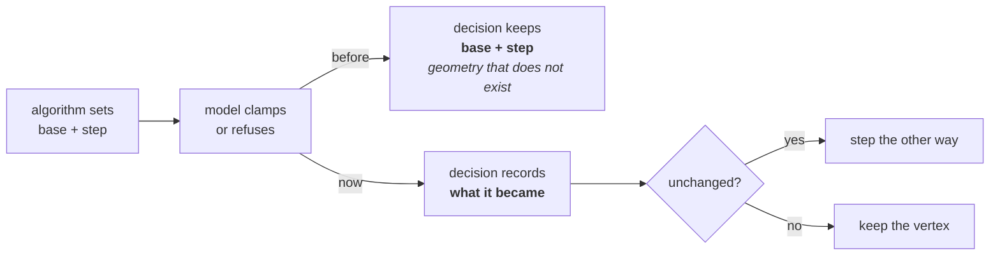

<!-- SPDX-License-Identifier: CC-BY-4.0 -->
# Native Downhill Simplex vs the Python (Trust Region) minimizer

Fit can run a fit with the native **Downhill Simplex (DHS)** engine or with the
**Python / lmfit Trust Region Reflective (trf)** backend. This note records how the
two compare in *fit quality*, because the honest answer has a subtlety that is easy
to get wrong.

## The subtlety: internal objective vs comparison metric

The two engines do **not** minimize the same thing:

| engine | what it minimizes internally |
|--------|------------------------------|
| native DHS | an **unweighted** squared R-factor, `SqrRFactor = Σ(model − data)² / (Σ model)²` (`fit_task.pas`, `GetSqrRFactor`) |
| Python trf | **Poisson-weighted** least squares, `Σ[(model − data)/√data]²` (`Worker/py/fitting.py`) |

So to compare them we compute a metric **after** each fit, from each engine's final
profile, the *same way for both* — the app already does this: the status-bar reduced
χ² is `fit_service_statistics.ComputeFitStatistics(..., WeightPoisson)`, computed
identically whichever engine ran. `tests/test_fit_quality.WeightedChiSquare` is the
shared helper the tests use.

**The fairness caveat:** that shared ruler is Poisson-weighted, which is *trf's own
objective*, not DHS's. Judging both by it gives trf a home-field advantage. To be
fair we score both results by **every** metric, including DHS's own.

## Measured result (Data/2.dat, 8× two-branch Pseudo-Voigt, ~40 free parameters)

| metric | DHS | Python (trf) | Python better by |
|--------|-----|--------------|------------------|
| `SqrRFactor` — **DHS's own objective** | 2.309e-4 | 6.148e-5 | **3.8×** |
| unweighted Σ(model−data)² | 2,142,221 | 532,073 | 4.0× |
| Poisson-weighted χ² — trf's objective, the app's displayed metric | 1111.1 | 149.7 | 7.4× |

The headline (7×) is inflated by the home advantage — but **even on DHS's own
`SqrRFactor`, Python is ~3.8× better**. The win is real, not an artefact of the
metric.

## Why — and when it does *not* hold

- **Dimensionality.** This fit has ~40 free parameters. A Nelder–Mead simplex
  degrades badly above ~10–20 dimensions (it collapses / stagnates far from the
  optimum); trf uses gradients and a trust region, which stay effective here. That is
  the whole story on this problem.
- **Small fits tie.** On a 1–3 parameter single peak the two are equivalent (a noisy
  synthetic Gaussian: 8.73 vs 8.75). There is no advantage to gain there.
- **DHS is faster.** ~1 s (compiled Pascal, ~1 µs per model evaluation) vs Python's
  ~1.3 s, and it needs no Python. For interactive single-peak work that matters.
- **Rugged landscapes favour the simplex.** trf trusts local gradients; on a
  multimodal objective that can mislead it, where a derivative-free simplex is more
  robust. Peak fitting is smooth, which is why trf wins here — do not over-generalise
  it to every problem.

**One-line summary:** for high-dimensional multi-peak fits the gradient minimizer is
measurably better — even on DHS's own metric — because a simplex scales poorly with
parameter count; for small fits they are equivalent and DHS is faster.

## Two defects fixed in the native simplex (2026-08)

Both let a fit stop while it still had work to do; neither is curve-type specific.

| Defect | What happened | Fix |
|---|---|---|
| **A refused step collapsed the simplex** | `FillParameters` pushed a value in, the model clamped or refused it, and the decision kept the value it had *asked* for. The algorithm reasoned about geometry that did not exist, and a refused step gave a vertex identical to the start — zero extent along that axis, unrecoverable and invisible. | Write the value the parameter actually took back into the decision; step the other way when the first direction is refused. |
| **Convergence judged by the objective's own magnitude** | The spread test is a fraction of the value, so any large constant term in the objective reports convergence immediately. | `FinalTolerance` 1e-3 → 1e-9 and demoted to the restart trigger; progress judged by whether the best decision is still improving. |

A parameter sits against a limit far more often than it looks: a width capped at
the edge of the data, an amplitude held non-negative at zero, a position on the
last data point. The first fix alone moved the Data/2.dat residual from
**702 108 to 660 287**.

### The progress test, and three ways it misbehaves

`MinRelImprovement` + `StagnationLimit` in `fitminimizers`, opt-in and off by
default. Each detail below was learned by getting it wrong:

| Detail | Wrong version | What it did |
|---|---|---|
| Window, not cycle | improvement checked per cycle | a simplex often spends cycles contracting without bettering its best vertex; cut a 24-parameter fit off after 12 cycles, 19 % below the unfitted baseline where it reaches 95 % |
| Window in **passes**, capped | window counted in cycles | one cycle moves one vertex, so N + 1 cycles pass before every parameter is touched; uncapped, a 1200-parameter model gets a 14 000-cycle window and never finishes |
| Improvement vs **gain so far** | vs the current value | as the objective approaches zero so does the threshold, so a millionth of it stays reachable forever — a model fitting to 1e-20 hung |

## Regression gates (the living version of this)

- `tests/testcase_python_real_data.PythonIsNoWorseThanDhsOn2Dat` — fits Data/2.dat
  with both engines and requires Python ≤ DHS on the shared weighted metric.
- `tests/testcase_python_backend_process.PythonQualityIsNoWorseThanNative` — the same
  comparison per curve type (Gaussian … 2-br PV, User).

Both are `Ignore`d when the Python sidecar venv is absent. To reproduce the full
table above, fit one `BuildTask` with `MinimizeDifference` and another through
`TPythonFitBackend`, then score each with the weighted, unweighted and `SqrRFactor`
(`Σ(model−data)² / (Σ model)²`) formulas — the numbers here are a snapshot on the
committed Data/2.dat, not a guaranteed constant.
