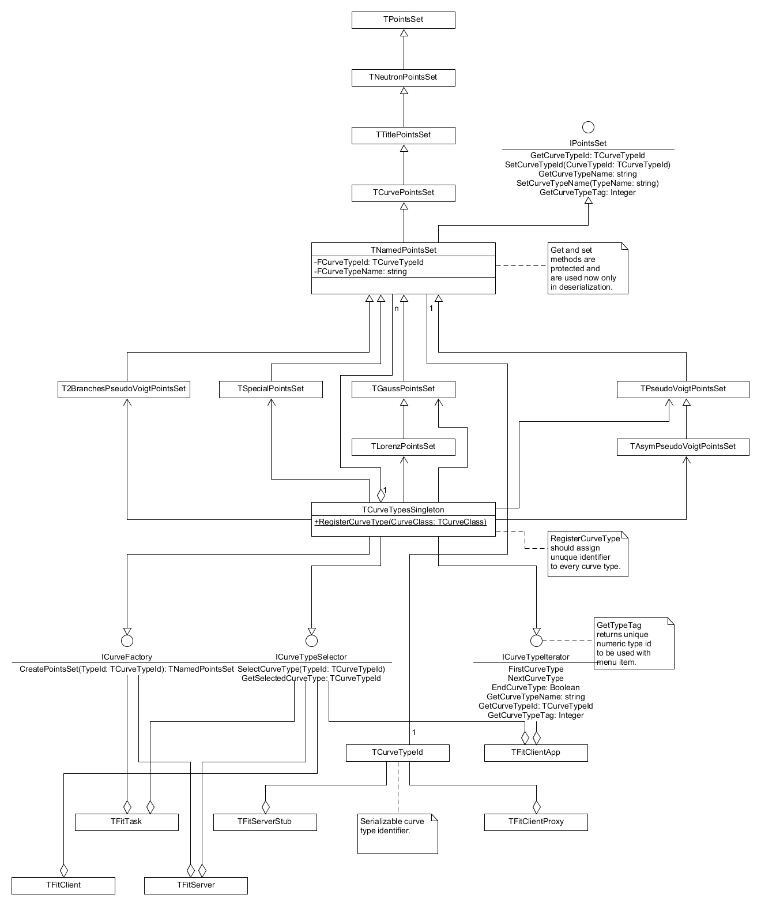

## How to add new curve type

The architecture is based on the dependency inversion principle. 

Each curve type should be defined in separate module and should implement defined interface. Curve class should register itself in the application by calling defined method of container class. Container class is responsible for keeping and providing to the application information about which curve types are available. It is responsible also for creating instances of curve clases. Container is a singleton. To add/exclude curve type to/from the application it is enough to add/exclude curve module to/from the project.

## Step-by-step instructions

1. Create new module and define new curve class and descent it from TNamedPointsSet. Implement methods of interface IPointsSet.

1. Instantiate TCurveTypesSingleton and call RegisterCurveType passing to it class of curve.

1. Add new module to the project. New class should be automatically displayed in the main menu.


