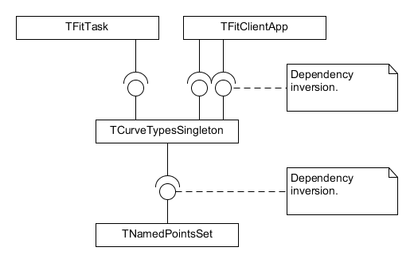

## How to add new curve type

The architecture is based on the dependency inversion principle. 

Each curve type should be defined in separate module and should implement interface IPointsSet. Curve class should register itself in the application by creating instance of singleton TCurveTypesSingleton and calling its method RegisterCurveType. Singleton is responsible for keeping and providing to the application information about which curve types are available. It is responsible also for creating instances of curve clases. To add/exclude curve type to/from the application it is enough to add/exclude curve module to/from Lazarus project.

## Step-by-step instructions

1. Create new module and define new curve class and derive it from TNamedPointsSet. 

1. Implement methods of interface IPointsSet. Make sure that GetCurveTypeName returns unique curve name and GetCurveTypeId_ return unuque curve type.

1. Instantiate TCurveTypesSingleton and call RegisterCurveType passing to it class of curve.

1. Add new module to the project. 

1. Add line creating instances of new class into TFitTask.GetPatternSpecimen.

1. Extend NamedPointsSetClasses array in TFormMain.ActionSelCurveExecute with type of new curve.

1. New curve type should be automatically displayed in the sub-menu "Model -> Pattern Type". Items are sorted alphabetically.


