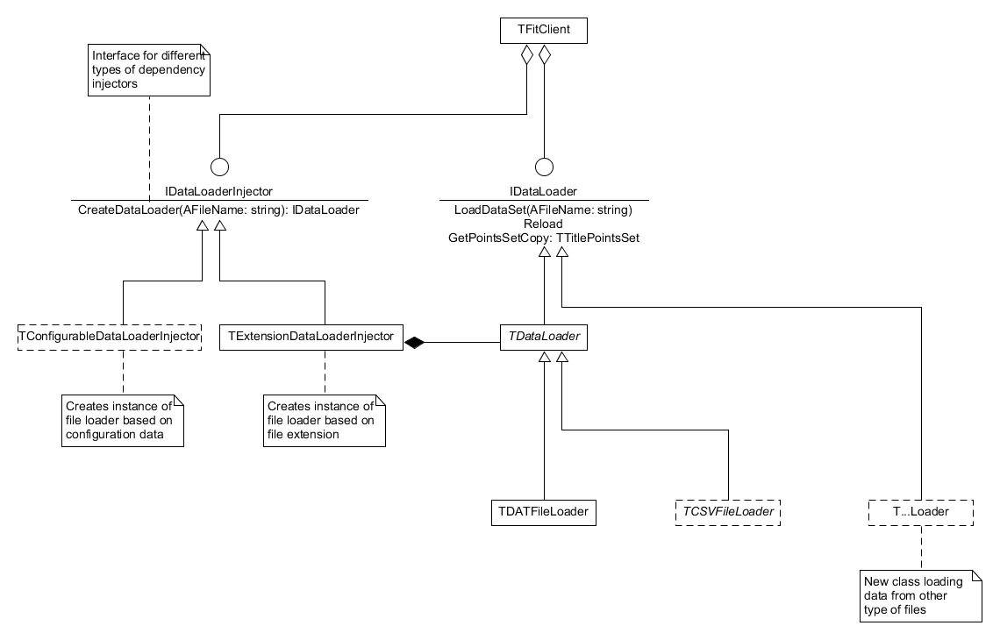

## How to add new data loader

The architecture is based on the dependency inversion principle and uses dependency injection pattern. Two kinds of classes are defined: "data loaders" and "injectors". "Data loaders" are responsible for reading data from specific file format, "injectors" are responsible for providing client with implementation of "data loader" according to some criteria. Both kinds implement specific interfaces. This allows to add new "data loaders" and "injectors" without modification of client. The implemented injector allows dynamic binding of client with some data loader based on file extension. Also another implementation is supposed based on some configuration attributes.

# Step-by-step instructions


